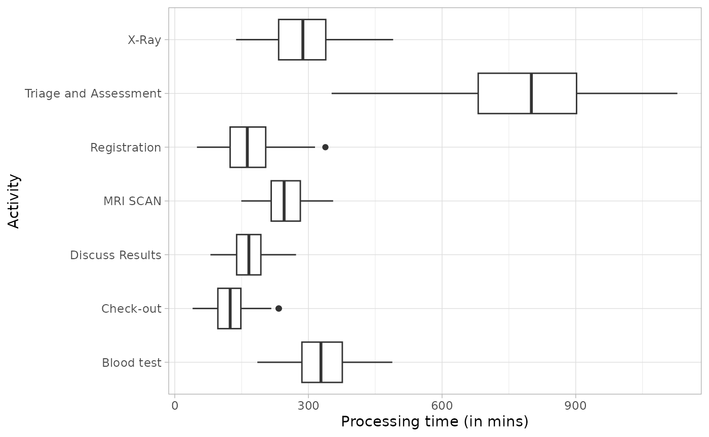
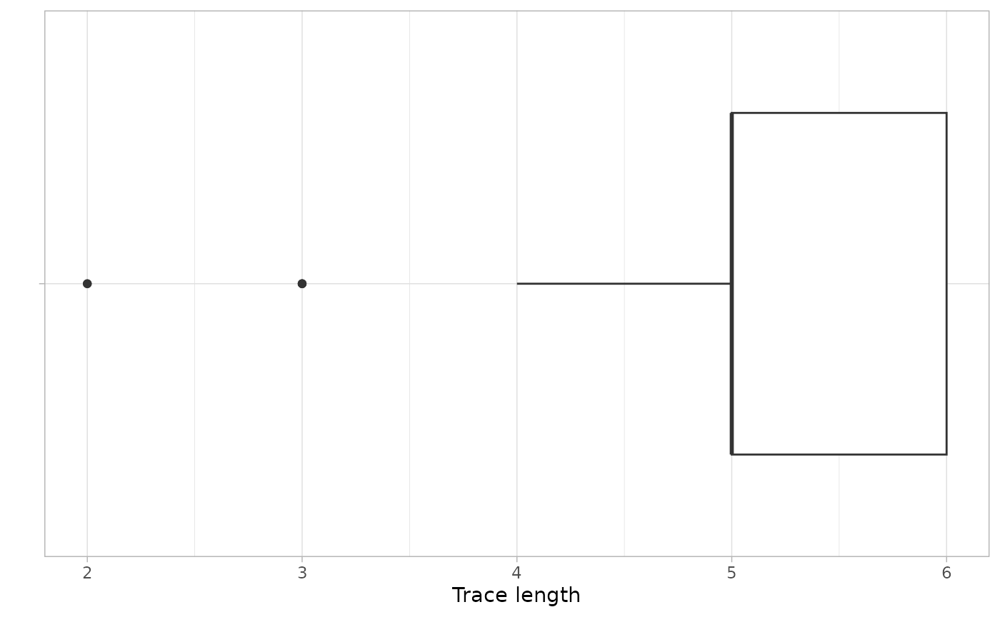

# Metrics

``` r
library(bupaR)
library(edeaR)
library(eventdataR)
```

The metrics for exploring and describing event data which are available
are based on literature in the field of operational excellence and are
organized in the following (sub)categories

- Time perspective
- Organizational perspective
- Structuredness perspective
  - Variance
  - Rework

## Time perspective

#### Idle Time

The idle time is the time that there is no activity in a case or for a
resource. It can only be calculated when there are both start and end
timestamps available for activity instances. It can be computed at the
levels trace, resource, case and log, and using different time units.

``` r
patients %>%
    idle_time("resource", units = "days")
```

    ## # A tibble: 7 × 2
    ##   employee idle_time    
    ##   <fct>    <drtn>       
    ## 1 r7       464.4199 days
    ## 2 r1       450.2124 days
    ## 3 r4       442.6260 days
    ## 4 r5       430.1764 days
    ## 5 r3       429.1064 days
    ## 6 r6       425.5362 days
    ## 7 r2       214.7436 days

The output of **all** metrics in edeaR can be visualized by supplying it
to the plot function.

``` r
patients %>%
    idle_time("resource", units = "days") %>%
    plot()
```

    ## Warning: `aes_string()` was deprecated in ggplot2 3.0.0.
    ## ℹ Please use tidy evaluation idioms with `aes()`.
    ## ℹ See also `vignette("ggplot2-in-packages")` for more information.
    ## ℹ The deprecated feature was likely used in the edeaR package.
    ##   Please report the issue at <https://github.com/bupaverse/edeaR/issues/>.
    ## This warning is displayed once every 8 hours.
    ## Call `lifecycle::last_lifecycle_warnings()` to see where this warning was
    ## generated.


#### Processing Time

The processing time can be computed at the levels log, trace, case,
activity and resource-activity. It can only be calculated when there are
both start and end timestamps available for activity instances.

``` r
patients %>% 
    processing_time("activity") %>%
    plot
```



#### Throughput Time

The throughput time is the time form the very first event to the last
event of a case. The levels at which it can be computed are log, trace,
or case.

``` r
patients %>%
    throughput_time("log") %>%
    plot()
```


## Organizational Perspective

#### Resource Frequency

The resource frequency metric allows the computation of the
number/frequency of resources at the levels of log, case, activity,
resource, and resource-activity.

``` r
patients %>%
    resource_frequency("resource")
```

    ## # A tibble: 7 × 3
    ##   employee absolute relative
    ##   <fct>       <int>    <dbl>
    ## 1 r1            500   0.184 
    ## 2 r2            500   0.184 
    ## 3 r6            495   0.182 
    ## 4 r7            492   0.181 
    ## 5 r5            261   0.0959
    ## 6 r3            237   0.0871
    ## 7 r4            236   0.0867

#### Resource Involvement

Resource involvement refers to the notion of the number of cases in
which a resource is involved. It can be computed at levels case,
resource, and resource-activity.

``` r
patients %>%
    resource_involvement("resource") %>% plot
```

 It this example it
shows that only r1 and r2 are involved in all cases, r6 and r7 are
involved in most of the cases, while the others are only involved in
half of the cases, more or less.

#### Resource Specialization

The resource specalization metric shows whether resources are
specialized in certain activities or not. It can be calculated at the
levels log, case, resource and activity.

``` r
patients %>%
    resource_specialisation("resource")
```

    ## # A tibble: 7 × 3
    ##   employee absolute relative
    ##   <fct>       <int>    <dbl>
    ## 1 r1              1    0.143
    ## 2 r2              1    0.143
    ## 3 r3              1    0.143
    ## 4 r4              1    0.143
    ## 5 r5              1    0.143
    ## 6 r6              1    0.143
    ## 7 r7              1    0.143

In the simple patients event log, each resource is performing exactly
one activity, and is therefore 100% specialized.

## Structuredness

### Variance

#### Activity Presence

Activity presence shows in what percentage of cases an activity is
present. It has no level-argument.

``` r
patients %>% activity_presence() %>%
    plot
```


#### Activity Frequency

The frequency of activities can be calculated using the
activity_frequency function, at the levels log, trace and activity.

``` r
patients %>%
    activity_frequency("activity")
```

    ## # A tibble: 7 × 3
    ##   handling              absolute relative
    ##   <fct>                    <int>    <dbl>
    ## 1 Registration               500   0.184 
    ## 2 Triage and Assessment      500   0.184 
    ## 3 Discuss Results            495   0.182 
    ## 4 Check-out                  492   0.181 
    ## 5 X-Ray                      261   0.0959
    ## 6 Blood test                 237   0.0871
    ## 7 MRI SCAN                   236   0.0867

#### Start Activities

The start of cases can be described using the start_activities function.
Available levels are activity, case, log, resource and resource
activity.

``` r
patients %>%
    start_activities("resource-activity")
```

    ## # A tibble: 1 × 5
    ##   employee handling     absolute relative cum_sum
    ##   <fct>    <fct>           <int>    <dbl>   <dbl>
    ## 1 r1       Registration      500        1       1

This shows that in this event log, all cases are started with the
Registration by resource r1.

#### End Activities

Conversely, the end_activities functions describes the end of cases,
using the same levels: log, case, activity, resource and
resource-activity.

``` r
patients %>%
    end_activities("resource-activity")
```

    ## # A tibble: 5 × 5
    ##   employee handling              absolute relative cum_sum
    ##   <fct>    <fct>                    <int>    <dbl>   <dbl>
    ## 1 r7       Check-out                  492    0.984   0.984
    ## 2 r6       Discuss Results              3    0.006   0.99 
    ## 3 r2       Triage and Assessment        2    0.004   0.994
    ## 4 r5       X-Ray                        2    0.004   0.998
    ## 5 r3       Blood test                   1    0.002   1

In contract to the start of cases, the end of cases seems to differ more
frequently, although it is mostly the Check-Out activity.

#### Trace Coverage

The trace coverage metric shows the relationship between the number of
different activity sequences (i.e. traces) and the number of cases they
cover.

``` r
patients %>%
    trace_coverage("trace") %>%
    plot()
```


In the patients log, there are only 7 different traces, and 2 of them
cover nearly 100% of the event log.

#### Trace Length

The trace length metric describes the length of traces, i.e. the number
of activity instances for each case. It can be computed at the levels
case, trace and log.

``` r
patients %>%
    trace_length("log") %>%
    plot
```



It can be seen that in this simple event log, most cases have a trace
length of 5 or 6, while a minority has a trace length lower than 5.
