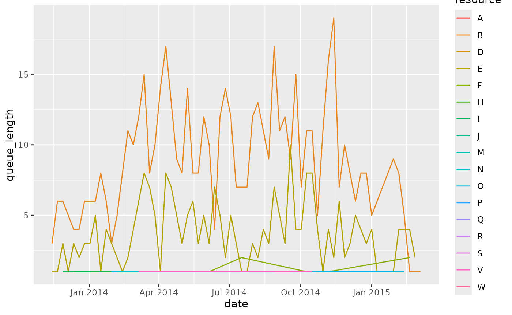
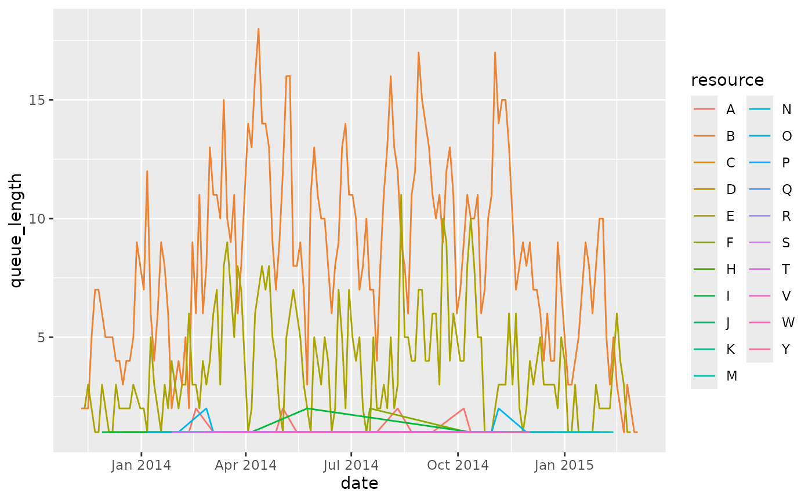

# Queue Analysis

``` r
library(edeaR)
#> 
#> Attaching package: 'edeaR'
#> The following object is masked from 'package:base':
#> 
#>     setdiff
library(dplyr)
#> 
#> Attaching package: 'dplyr'
#> The following objects are masked from 'package:stats':
#> 
#>     filter, lag
#> The following objects are masked from 'package:base':
#> 
#>     intersect, setdiff, setequal, union
```

## Calculate queueing times

The function calculate_queueing_times can be used to calculate for each
activity instance in the log when it was started, and since when it was
queued. (That is, each activity instance except the first one for each
case).

For example, for the sepsis event log

``` r
library(eventdataR)
calculate_queuing_times(sepsis) -> queuing_times
```

The result is the following:

``` r
queuing_times
#> # A tibble: 14,164 × 7
#>    case_id activity         activity_instance_id resource started            
#>    <chr>   <fct>            <chr>                <fct>    <dttm>             
#>  1 XJ      ER Triage        3835                 C        2013-11-07 08:29:18
#>  2 XJ      ER Sepsis Triage 3836                 A        2013-11-07 08:37:32
#>  3 XJ      CRP              3839                 B        2013-11-07 08:51:00
#>  4 XJ      LacticAcid       3837                 B        2013-11-07 08:51:00
#>  5 XJ      Leucocytes       3838                 B        2013-11-07 08:51:00
#>  6 XJ      IV Liquid        3840                 A        2013-11-07 09:05:57
#>  7 XJ      IV Antibiotics   3841                 A        2013-11-07 10:05:58
#>  8 XJ      Admission NC     3842                 I        2013-11-07 11:11:34
#>  9 XJ      Leucocytes       3843                 B        2013-11-08 08:00:00
#> 10 I       ER Triage        106                  C        2013-11-09 09:34:28
#> # ℹ 14,154 more rows
#> # ℹ 2 more variables: in_queue_since <dttm>, time_in_queue <drtn>
```

We can use the output to compare the times time in queue for different
activities, for example.

``` r
library(ggplot2)
#> Warning: package 'ggplot2' was built under R version 3.6.3
queuing_times %>%
  ggplot(aes(activity, time_in_queue)) +
  geom_boxplot()
#> Don't know how to automatically pick scale for object of type <difftime>.
#> Defaulting to continuous.
```


Or between different resources:

``` r
queuing_times %>%
  ggplot(aes(resource, time_in_queue)) +
  geom_boxplot()
#> Don't know how to automatically pick scale for object of type <difftime>.
#> Defaulting to continuous.
```


If we remove the “?” resource:

``` r
queuing_times %>%
  filter(resource != "?") %>%
  ggplot(aes(resource, time_in_queue)) +
  geom_boxplot()
#> Don't know how to automatically pick scale for object of type <difftime>.
#> Defaulting to continuous.
```


## Calculate queue length

Based on the information about queuing times, we can also compute the
length of the queue. This can be done using the function
calculate_queue_length. For this, we need to decide at which time
interval we want to compute the length of the queue. For example, we can
compute the length of the queue for each day, each week, each month,
etc. The sepsis data covers approximately 1.5 years. Computing the queue
for each week will thus give us about 75 different observations.

``` r
queuing_times %>%
  calculate_queuing_length(time_interval = "week")
#> # A tibble: 83 × 2
#>    date       queue_length
#>    <date>            <int>
#>  1 2013-11-07            0
#>  2 2013-11-14            5
#>  3 2013-11-21           11
#>  4 2013-11-28           15
#>  5 2013-12-05           17
#>  6 2013-12-12           19
#>  7 2013-12-19           21
#>  8 2013-12-26           27
#>  9 2014-01-02           32
#> 10 2014-01-09           36
#> # ℹ 73 more rows
```

The first observation is the data above will always be the first
timestamp for which an event was recorded. At this point, the queue will
always be zero. The second observation is the queue length after one
week, etc. We can plot this data to see the evolution of the queue over
time.

``` r
queuing_times %>%
  calculate_queuing_length(time_interval = "week") %>%
  ggplot(aes(date, queue_length)) +
  geom_line()
```


Of course, you need to be careful when interpreting both extremes of
this time range, because we only have complete cases. At the start of
the time range, the process is “building up” activity, and the queue
goes up. At the end of the time range, the last cases are being
finished, and the queue gradually empties. It takes some knowledge about
the data to decide on a time frame that is proper for analysis.

## By resource or activity

The length of the queue shown above refers to all queued activity
instances in the process. We can also look at queue length by either
activity or by resource. This can be done by changing the level argument
in the calculation function.

``` r
queuing_times %>%
  calculate_queuing_length(time_interval = "week", level = "resource") 
#> # A tibble: 258 × 3
#>    date       resource queue_length
#>    <date>     <fct>           <int>
#>  1 2013-11-14 ?                   1
#>  2 2013-11-14 B                   3
#>  3 2013-11-14 E                   1
#>  4 2013-11-21 ?                   4
#>  5 2013-11-21 B                   6
#>  6 2013-11-21 E                   1
#>  7 2013-11-28 ?                   5
#>  8 2013-11-28 B                   6
#>  9 2013-11-28 E                   3
#> 10 2013-11-28 I                   1
#> # ℹ 248 more rows
queuing_times %>%
  calculate_queuing_length(time_interval = "week", level = "activity") 
#> # A tibble: 340 × 3
#>    date       activity     queue_length
#>    <date>     <fct>               <int>
#>  1 2013-11-14 CRP                     3
#>  2 2013-11-14 Release A               1
#>  3 2013-11-14 Return ER               1
#>  4 2013-11-21 CRP                     5
#>  5 2013-11-21 Leucocytes              1
#>  6 2013-11-21 Release A               1
#>  7 2013-11-21 Return ER               4
#>  8 2013-11-28 Admission NC            1
#>  9 2013-11-28 CRP                     5
#> 10 2013-11-28 Leucocytes              1
#> # ℹ 330 more rows
```

Again, these can be plotted conveniently (we ignore the unknown
resource):

``` r
queuing_times %>%
  filter(resource != "?") %>%
  calculate_queuing_length(time_interval = "week", level = "resource") %>%
  ggplot(aes(date, queue_length, color = resource)) +
  geom_line()
```



## The impact of the time interval

If we increase the time interval, the queue length is calculated after
longer periods of time, so the data becomes more sparse. For example,
calculating after a month instead of a week:

``` r
queuing_times %>%
  filter(resource != "?") %>%
  calculate_queuing_length(time_interval = "month", level = "resource") %>%
  ggplot(aes(date, queue_length, color = resource)) +
  geom_line()
```


We can set it to a integer number to indicate an interval of x days. For
example, every 3 days:

``` r
queuing_times %>%
  filter(resource != "?") %>%
  calculate_queuing_length(time_interval = 3, level = "resource") %>%
  ggplot(aes(date, queue_length, color = resource)) +
  geom_line()
```



The time interval should be chosen carefully. Note that a very small
interval (the smallest possible is “day”) can be computationally
expensive if your event log covers a long time period.

## Some important remarks - caution needed!

The calculations of queues is based on some assumptions that are
important to understand when drawing conclusions about these numbers.

Firstly, it starts from the log, and nothing more. It does not take any
process model notion into account. We assume that an activity instance
could have started if the previous one was finished. However, if the
activity in question and the previous one can be executed in parallel,
the activity in question could have been started earlier, and thus we
underestimate its time in the queue.

Relatedly, if the activity in question actually overlaps with the
previous one, you will get a negative queue time, because following the
above theory, it started to early. (Of course, this can only happen when
you have start and end events). The current implemention does not notify
you if this happens, but could check for it in the result of the
queueing times, and decide how to handle it (e.g. remove with zero or
NA).

Secondly, there might be other factors, which are not present in the
data, that impact when something starts to queue or not. If somewhere
between two activities a decision is made on how to proceed with the
case, the queueing of the second activity didn’t really start after the
first, but after the decision was made.

Finally, an important remark should be made regarding the resource. If
we compute the queue length of a resource, as shown above, all the
activities that this resouces executed are added to the queue once the
previous activity instance was finished. This might not accurately
represent reality, because it assume that executions are assigned to a
resource queue up-front, i.e. once they are enabled (taking into account
the previous two points on the heuristic we use to define that moment),
and not at a latter stage. It might for instance be the situation that
queued cases are added to a queue that is not necessarily tied to a
single resource, but from which resources can pick a task once they are
free to start some (or at any point in time between the task being added
to the list, and the task being started).

Because of these reasons, some caution is necessary when analysing
queuing times and length, as the heuristic, solely based on the avaiable
process data does not take into account a process/workflow or the
context of task assignment.
